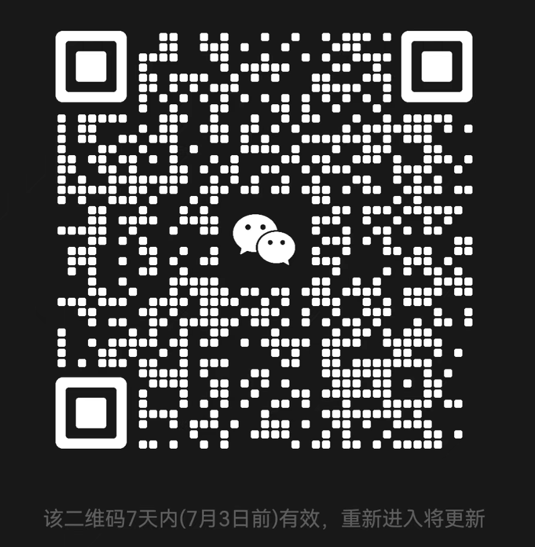

# Agent 学习讨论

这是一个关于 **Agent 学习与交流讨论** 的内容记录。

大家可以一起把自己的问题或者自己想要的话题拿出来讨论，看文档，写demo，搞多了没有边界，搞的很无聊。可以定义方向一起去研究

目前主要是整理我自己正在学习、正在阅读、正在实践的一些 Agent 相关内容，包括但不限于：

* Agent 基础概念
* RAG 与 Agent 的结合
* Tool Calling / Function Calling
* ReAct 模式
* 多 Agent 协作
* 记忆机制
* Prompt 工程
* 开源 Agent 项目学习
* 实际项目中的 Agent 架构设计

## 说明

这个内容主要用于学习交流，不是正式教程，也不是商业项目。

我会把当前正在看的资料、代码、项目理解、问题记录和一些实践经验整理在这里，方便后续复盘，也方便和同样在学习 Agent 的朋友一起讨论。

如果你也在学习 Agent、RAG、LLM 应用开发，或者对相关项目感兴趣，可以一起交流。

## 当前学习方向

目前重点关注：

1. Agent 的基本工作流程
2. Agent 如何调用工具
3. Agent 如何做记忆管理
4. Agent 如何结合 RAG
5. 开源 Agent 框架源码学习
6. 如何从 demo 走向真实项目落地

## 交流内容

可以讨论的问题包括：

* Agent 项目怎么入门
* RAG 链路怎么设计
* Prompt 怎么写更稳定
* Tool Calling 和 ReAct 有什么区别
* 多 Agent 怎么路由
* 记忆模块怎么设计
* 开源项目源码怎么看
* 如何做一个可落地的 Agent 应用

## 联系方式

联系方式：`cc768633156`

欢迎一起学习、交流、讨论。
